# GitHub Actions CI/CD for Delux+

Automated deployment from GitHub to Google Cloud Platform.

## 📚 Documentation

| Document | Description | Time to Read |
|----------|-------------|--------------|
| [🚀 Quick Start](QUICK-START.md) | Get started in 5 minutes | 5 min |
| [📋 Setup Checklist](SETUP-CHECKLIST.md) | Step-by-step setup guide | 10 min |
| [📖 Complete Guide](CICD-SETUP.md) | Detailed configuration and troubleshooting | 20 min |
| [📊 Summary](../CICD-SUMMARY.md) | Overview and usage examples | 10 min |

## 🎯 Quick Setup

```bash
# 1. Run setup script
./setup-cicd.sh

# 2. Add secrets to GitHub
# Go to: Settings → Secrets and variables → Actions
# Add the 10 secrets from script output

# 3. Test deployment
git add .
git commit -m "test: CI/CD"
git push origin main

# 4. Clean up
rm github-actions-key.json firebase-github-actions-key.json
```

## 🔄 Workflows

### Deploy Backend (`deploy-backend.yml`)
- **Trigger:** Push to `main` with backend changes
- **Duration:** ~3-5 minutes
- **Output:** New Cloud Run revision

### Deploy Frontend (`deploy-frontend.yml`)
- **Trigger:** Push to `main` with frontend changes
- **Duration:** ~2-3 minutes
- **Output:** New Firebase Hosting deployment

### Run Tests (`run-tests.yml`)
- **Trigger:** Push or PR to `main`/`develop`
- **Duration:** ~2-4 minutes
- **Output:** Test results

## 📦 What Gets Deployed

```
Push to main
     │
     ├─ backend/ changes → Cloud Run
     │   ├─ Build Docker image
     │   ├─ Push to GCR
     │   ├─ Deploy to Cloud Run
     │   └─ Health check
     │
     └─ frontend/ changes → Firebase Hosting
         ├─ Install dependencies
         ├─ Build React app
         └─ Deploy to Firebase
```

## 🔐 Required Secrets

| Secret | Description |
|--------|-------------|
| `GCP_PROJECT_ID` | Your GCP project ID |
| `GCP_SA_KEY` | Service account key (JSON) |
| `FIREBASE_SERVICE_ACCOUNT` | Firebase SA key (JSON) |
| `SQL_INSTANCE_NAME` | Cloud SQL instance name |
| `DB_NAME` | Database name |
| `DB_USER` | Database user |
| `GCS_BUCKET_NAME` | Storage bucket name |
| `SERVICE_ACCOUNT_EMAIL` | Backend SA email |
| `BACKEND_URL` | Backend Cloud Run URL |
| `FRONTEND_URL` | Frontend Firebase URL |

## 🎮 Usage

### Automatic Deployment

```bash
# Just push to main!
git push origin main
```

### Manual Deployment

1. Go to Actions tab
2. Select workflow
3. Click "Run workflow"
4. Select branch and run

### Monitor Deployment

```bash
# View in GitHub
https://github.com/YOUR_USERNAME/YOUR_REPO/actions

# Or use CLI
gh run list
gh run view RUN_ID --log
```

## 🔧 Troubleshooting

| Issue | Solution |
|-------|----------|
| "Secret not found" | Add missing secret in GitHub settings |
| "Permission denied" | Re-run setup script |
| "Health check failed" | Check Cloud Run logs |
| "Build failed" | Test build locally first |

## 📊 Deployment Flow

```mermaid
graph TD
    A[Push to main] --> B{Changes in?}
    B -->|backend/| C[Backend Workflow]
    B -->|frontend/| D[Frontend Workflow]
    B -->|both| E[Both Workflows]
    
    C --> C1[Build Docker]
    C1 --> C2[Push to GCR]
    C2 --> C3[Deploy to Cloud Run]
    C3 --> C4[Health Check]
    C4 --> F[✅ Done]
    
    D --> D1[Install deps]
    D1 --> D2[Build React]
    D2 --> D3[Deploy to Firebase]
    D3 --> F
    
    E --> C
    E --> D
```



## 🎯 Success Criteria

✅ Push to `main` triggers deployment  
✅ Deployment completes in 3-5 minutes  
✅ Health checks pass  
✅ Application works correctly  
✅ No secrets in repository  

## 🔄 Rollback

### Backend
```bash
gcloud run revisions list --service=delux-plus-backend --region=asia-east1
gcloud run services update-traffic delux-plus-backend \
    --to-revisions=PREVIOUS_REVISION=100 --region=asia-east1
```

### Frontend
```bash
firebase hosting:rollback
```

## 💡 Tips

- Test in a branch before merging to `main`
- Use pull requests for code review
- Monitor first few deployments closely
- Set up notifications (optional)
- Keep service account keys secure

## 📈 Next Steps

- [ ] Set up staging environment
- [ ] Add deployment notifications
- [ ] Configure branch protection
- [ ] Set up automated rollbacks
- [ ] Add performance monitoring

## 🆘 Need Help?

1. Check [troubleshooting guide](CICD-SETUP.md#troubleshooting)
2. Review GitHub Actions logs
3. Check GCP service logs
4. Consult [complete guide](CICD-SETUP.md)

## 📞 Support

- [GitHub Actions Docs](https://docs.github.com/en/actions)
- [Cloud Run Docs](https://cloud.google.com/run/docs)
- [Firebase Hosting Docs](https://firebase.google.com/docs/hosting)

---

**Ready to deploy?** Follow the [Quick Start Guide](QUICK-START.md)! 🚀
